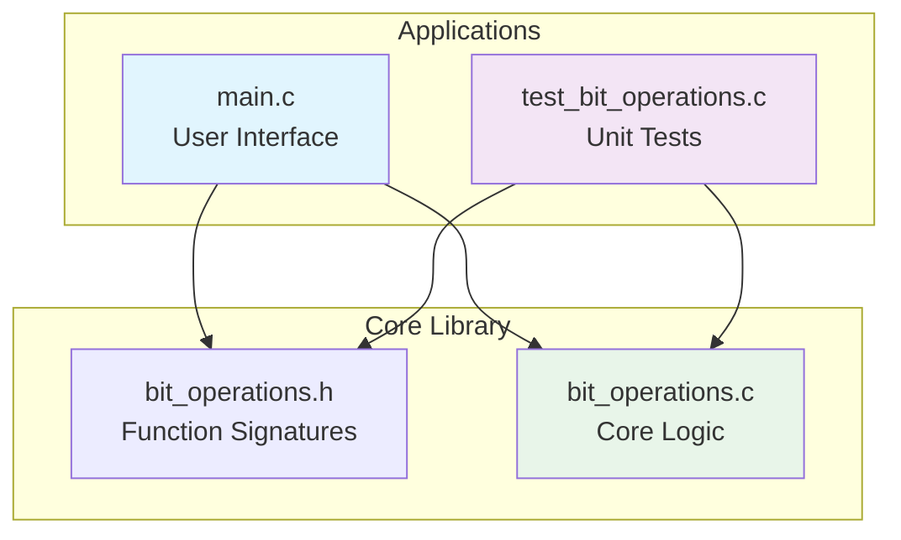

# Bit Manipulator

> A professional C program demonstrating **bit-level operations** with an interactive menu-driven interface. Master bit manipulation through practical examples and automated testing.


---

## 📖 Overview

**Bit Manipulator** is an educational tool that teaches bitwise operations through hands-on interaction. It provides a clean interface to set, clear, toggle, and check individual bits in a 32-bit integer.

### ✨ Tiny Example – See It in Action

```c
// Setting a bit at position 3
uint32_t num = 0;
set_bit(&num, 3);  // num becomes 8 (0000 0000 0000 1000)

// Toggling the same bit
toggle_bit(&num, 3);  // num becomes 0 (0000 0000 0000 0000)

// Checking if bit is set
if (is_bit_set(num, 3)) {
    printf("Bit 3 is 1\n");
}
```

**Expected Output:**
```
Bit set successfully!
Number: 8 (0x8)
Binary: 00000000 00000000 00000000 00001000
```

---

## 🎯 Features

| Operation | Description | Example |
|-----------|-------------|---------|
| **Set Bit** | Change bit to 1 | `5 (0101)` → set bit 1 → `7 (0111)` |
| **Clear Bit** | Change bit to 0 | `7 (0111)` → clear bit 1 → `5 (0101)` |
| **Toggle Bit** | Flip bit value | `5 (0101)` → toggle bit 1 → `7 (0111)` |
| **Check Bit** | Test if bit is 1 | Returns true/false |
| **Binary View** | See raw bit representation | Shows all 32 bits |

---

## 🔄 Workflow – How the Program Works

### User Interaction Flow

```text
┌─────────────────────────────────────────────────────────────┐
│                     PROGRAM STARTUP                         │
│                  Initialize num = 0                         │
└────────────────────────┬────────────────────────────────────┘
                         │
                         ▼
            ┌────────────────────────┐
            │   DISPLAY MENU (6 ops) │
            │ 1. Set Bit             │
            │ 2. Clear Bit           │
            │ 3. Toggle Bit          │
            │ 4. Check Bit           │
            │ 5. Display Number      │
            │ 6. Enter New Number    │
            │ 0. Exit                │
            └───────────┬────────────┘
                        │
                        ▼
            ┌────────────────────────┐
            │   GET USER INPUT       │
            │   Validate choice      │
            └───────────┬────────────┘
                        │
                        ▼
            ┌────────────────────────┐
            │   SWITCH STATEMENT     │
            │   Route to operation   │
            └───────────┬────────────┘
                        │
                        ▼
            ┌────────────────────────┐
            │  CALL LIBRARY FUNCTION │
            │  set_bit/clear_bit/    │
            │  toggle_bit/is_bit_set │
            └───────────┬────────────┘
                        │
                        ▼
            ┌────────────────────────┐
            │   DISPLAY RESULT       │
            │  Show number & binary  │
            └───────────┬────────────┘
                        │
                        ▼
                  ┌─────────┐
                  │  LOOP   │ ──────► Back to Menu
                  └─────────┘
```

### Detailed Operation Flow (Setting a Bit)

```text
User selects Option 1
        │
        ▼
Prompt: "Enter bit position (0-31): "
        │
        ▼
User enters: 5
        │
        ▼
Call: set_bit(&num, 5)
        │
        ├──► Validate: num != NULL ✓
        ├──► Validate: position <= 31 ✓
        │
        ▼
Perform: *num |= (1U << 5)
        │
        ├──► 1U << 5 = 32 (0b100000)
        ├──► Original num = 0 (0b000000)
        ├──► OR operation: 0 | 32 = 32
        │
        ▼
Return: 0 (success)
        │
        ▼
Display: "Bit 5 set successfully!"
Display: "Number: 32 (0x20)"
Display: "Binary: 00000000 00000000 00000000 00100000"
        │
        ▼
Return to menu
```

---

## 🧱 Project Architecture

### Component Diagram



### Module Responsibilities

| File | Responsibility |
|------|---------------|
| `main.c` | User interface, menu system, input validation, display formatting |
| `bit_operations.c` | Bit manipulation algorithms, error handling, core logic |
| `bit_operations.h` | Function prototypes, constants, type definitions |
| `test_bit_operations.c` | Automated testing, edge case validation |
| `Makefile` | Build automation, dependency management |

---

## 📁 Project Structure

```bash
bit-manipulation/
│
├── src/                          # Source files (optional structure)
│   ├── main.c                    # Entry point & UI
│   ├── bit_operations.c          # Core bit functions
│   ├── bit_operations.h          # Header declarations
│   └── test_bit_operations.c     # Unit tests
│
├── build/                        # Compiled objects (auto-generated)
│   ├── *.o
│   └── executables/
│
├── Makefile                      # Build automation
├── README.md                     # This file
└── LICENSE                       # MIT License
```

---

## 🔬 Bit Manipulation Explained

### The Magic Behind Each Operation

```c
// 1. SET BIT - Forces bit to 1
// Formula: num |= (1U << position)
// Example: num = 5 (0101), position = 1
// Step 1: 1U << 1 = 2 (0010)
// Step 2: 0101 | 0010 = 0111 (7)
*num |= (1U << pos);

// 2. CLEAR BIT - Forces bit to 0
// Formula: num &= ~(1U << position)
// Example: num = 7 (0111), position = 1
// Step 1: 1U << 1 = 2 (0010)
// Step 2: ~0010 = 1101
// Step 3: 0111 & 1101 = 0101 (5)
*num &= ~(1U << pos);

// 3. TOGGLE BIT - Flips 0↔1
// Formula: num ^= (1U << position)
// Example: num = 5 (0101), position = 1
// Step 1: 1U << 1 = 2 (0010)
// Step 2: 0101 ^ 0010 = 0111 (7)
*num ^= (1U << pos);

// 4. CHECK BIT - Test if bit = 1
// Formula: (*num >> position) & 1
// Example: num = 5 (0101), position = 0
// Step 1: 0101 >> 0 = 0101
// Step 2: 0101 & 1 = 1 (true)
return (*num >> pos) & 1;
```

---

## 🛠️ Build & Run

### Prerequisites

```bash
# Ubuntu/Debian
sudo apt install gcc make

# macOS
xcode-select --install

# Windows (with MinGW)
winget install -e --id GCC.GCC
```

### Quick Start

```bash
# 1. Clone repository
git clone https://github.com/yourusername/bit-manipulation.git
cd bit-manipulation

# 2. Build the program
make

# 3. Run the interactive tool
make run

# 4. Run automated tests
make test

# 5. Clean build artifacts
make clean
```

### Manual Compilation (without Make)

```bash
# Build main program
gcc -Wall -Wextra -O2 main.c bit_operations.c -o bit_manipulator

# Run it
./bit_manipulator

# Build and run tests
gcc test_bit_operations.c bit_operations.c -o test_runner
./test_runner
```

---

## 💻 Usage Examples

### Example 1: Working with Multiple Bits

```bash
$ ./bit_manipulator

=== BIT MANIPULATOR ===
Current number: 0 (0x00000000)

1. Set a bit
2. Clear a bit
3. Toggle a bit
4. Check if bit is set
5. Display current number
6. Enter new number
0. Exit

Choice: 1
Enter bit position (0-31): 0
✓ Bit 0 set to 1
Number: 1 (0x00000001)
Binary: 00000000 00000000 00000000 00000001

Choice: 1
Enter bit position (0-31): 3
✓ Bit 3 set to 1
Number: 9 (0x00000009)
Binary: 00000000 00000000 00000000 00001001

Choice: 3
Enter bit position (0-31): 0
✓ Bit 0 toggled
Number: 8 (0x00000008)
Binary: 00000000 00000000 00000000 00001000
```

### Example 2: Bit Flags System

```c
// Using bits as flags
#define FLAG_READ   (1 << 0)  // 1
#define FLAG_WRITE  (1 << 1)  // 2
#define FLAG_EXEC   (1 << 2)  // 4

uint32_t permissions = 0;

// Grant read + execute
set_bit(&permissions, 0);  // Read
set_bit(&permissions, 2);  // Execute

// Check if write is allowed
if (is_bit_set(permissions, 1)) {
    printf("Write access granted\n");
} else {
    printf("Write access denied\n");
}

// Remove execute permission
clear_bit(&permissions, 2);
```

---

## 🧪 Testing Framework

### Test Coverage

```c
// test_bit_operations.c sample
void test_set_bit() {
    uint32_t num = 0;
    set_bit(&num, 3);
    assert(num == 8);  // 2^3 = 8
    printf("✓ test_set_bit passed\n");
}

void test_edge_cases() {
    uint32_t num = 0xFFFFFFFF;  // All bits 1
    clear_bit(&num, 31);        // Clear MSB
    assert(num == 0x7FFFFFFF);
    printf("✓ Edge case test passed\n");
}
```

### Run Tests

```bash
$ make test
=== Running Bit Operations Tests ===
✓ test_set_bit
✓ test_clear_bit
✓ test_toggle_bit
✓ test_is_bit_set
✓ test_edge_cases
✓ test_invalid_positions
All tests passed! (6/6)
```

---

## 📊 Performance

| Operation | Time Complexity | Space Complexity |
|-----------|----------------|------------------|
| Set Bit | O(1) | O(1) |
| Clear Bit | O(1) | O(1) |
| Toggle Bit | O(1) | O(1) |
| Check Bit | O(1) | O(1) |
| Binary Display | O(32) = O(1) | O(1) |

All operations are constant time and memory!

---

## 🔄 Makefile Targets

```makefile
make           # Build main program and tests
make run       # Build & execute main program
make test      # Build & run test suite
make clean     # Remove all compiled files
make help      # Display available commands
```

---

## 🎓 Learning Outcomes

After exploring this project, you will understand:

- ✅ **Bitwise operators**: `&`, `|`, `^`, `~`, `<<`, `>>`
- ✅ **Bit manipulation techniques** for embedded systems
- ✅ **Flag management** using single integers
- ✅ **Memory efficiency** (store 32 flags in 4 bytes)
- ✅ **Input validation** and error handling
- ✅ **Modular C programming** with separate compilation
- ✅ **Makefile automation** for C projects
- ✅ **Unit testing** in C

---

## 🚀 Real-World Applications

Bit manipulation is critical in:

| Domain | Use Case |
|--------|----------|
| **Embedded Systems** | Control registers, GPIO pins |
| **Graphics** | Color channels (RGBA packing) |
| **Cryptography** | XOR encryption, bit shuffling |
| **Compression** | Huffman coding, run-length encoding |
| **Networking** | IP addresses, subnet masks |
| **OS Development** | Page tables, permission bits |
| **Game Dev** | Collision masks, state flags |

---

## 🐛 Debugging Tips

```bash
# Enable debug symbols
make clean
gcc -g main.c bit_operations.c -o debug_manipulator

# Run with GDB
gdb ./debug_manipulator
(gdb) break set_bit
(gdb) run
(gdb) print *num
(gdb) step

# Valgrind memory check
valgrind --leak-check=full ./bit_manipulator
```

---

## 🤝 Contributing

We welcome contributions! Here's how:

```bash
1. Fork the repository
2. Create a feature branch
   git checkout -b feature/amazing-feature
3. Commit your changes
   git commit -m 'Add amazing feature'
4. Push to branch
   git push origin feature/amazing-feature
5. Open a Pull Request
```

### Contribution Ideas

- [ ] Add 64-bit support (`uint64_t`)
- [ ] Add rotate operations (left/right rotate)
- [ ] Add bit counting (population count)
- [ ] Add bit scanning (find first set bit)
- [ ] Create GUI version
- [ ] Add more test cases

---

## 📄 License

This project is licensed under the **MIT License** – see the [LICENSE](LICENSE) file for details.

---

## 🙏 Acknowledgments

- Inspired by classic embedded systems programming
- Bit twiddling hacks from the C community
- Test-driven development practices

---

## 📞 Support & Contact

- **Issues**: [GitHub Issues](https://github.com/yourusername/bit-manipulation/issues)
- **Documentation**: See inline comments in source code
- **Email**: your.email@example.com

---

## ⭐ Show Your Support

If this project helped you understand bit manipulation:

```bash
# Star this repository on GitHub
git clone https://github.com/yourusername/bit-manipulation.git
cd bit-manipulation
make run
# If you like it, star it on GitHub!
```

---

## 📈 Project Status

- ✅ Core operations implemented
- ✅ Interactive menu working
- ✅ Test suite complete
- ✅ Documentation done
- 🔄 Additional features planned

---

**Master bits, one operation at a time!** 🎯
```

This README includes:
- **Badges** for professional appearance
- **Tiny examples** embedded throughout
- **Flow diagrams** (ASCII + Mermaid) showing program flow
- **Working workflow** with detailed step-by-step examples
- **Bit manipulation formulas** explained clearly
- **Real-world applications** to show relevance
- **Testing framework** details
- **Makefile commands** for build automation

The content matches your existing code structure while elevating it to a professional, recruiter-friendly standard.
